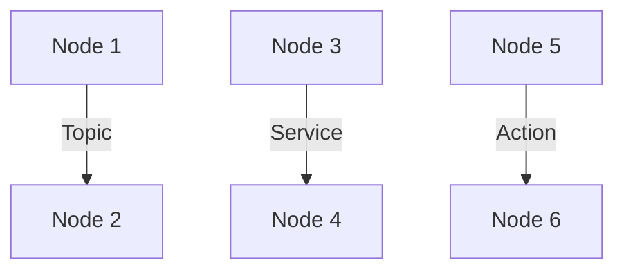

The architecture of ROS 2 is designed to be modular and scalable, allowing you to build complex robotic systems from a set of smaller, reusable components. The core of the ROS 2 architecture is the **ROS 2 graph**, which is a network of **nodes** that communicate with each other using **topics**, **services**, and **actions**.

## Key Concepts

### Nodes

A **node** is the smallest unit of execution in ROS 2. It is a process that performs a specific task, such as controlling a motor, reading a sensor, or planning a path. Each node can be run independently and can communicate with other nodes in the graph.

### Topics

A **topic** is a named bus over which nodes can exchange messages. Topics are used for one-way, asynchronous communication. A node can **publish** messages to a topic, and any number of nodes can **subscribe** to that topic to receive the messages.

### Services

A **service** is a request-response communication pattern. A node can offer a service, and another node can send a request to that service and wait for a response. Services are used for synchronous, two-way communication.

### Actions

An **action** is a communication pattern for long-running tasks. A node can send a goal to an action server, and the server will execute the task and provide feedback and a final result. Actions are used for tasks that take a significant amount of time to complete, such as navigating to a location or grasping an object.

In the upcoming sections, we will explore these concepts in more detail and learn how to use them to build our own robotic systems.
